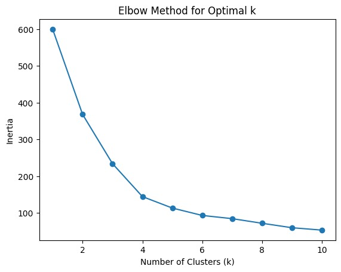
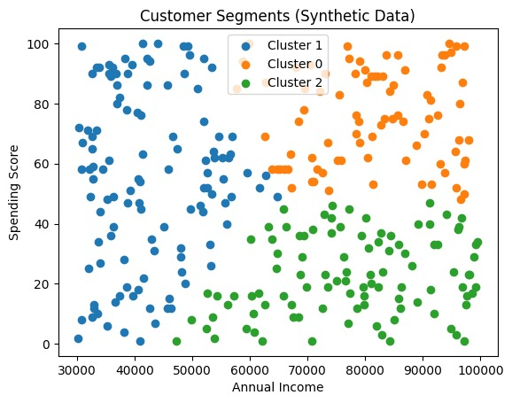
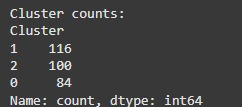

# 🧠 Customer Segmentation using K-Means & Elbow Method

This project demonstrates how unsupervised machine learning can be used to create meaningful customer segments based on **Annual Income** and **Spending Score**.  
Using the **Elbow Method**, we determined the optimal number of clusters and applied **K-Means Clustering** to identify distinct customer groups.

---

## 📌 Project Overview

| Category | Description |
|--------|------------|
| **Objective** | Segment customers to uncover purchasing behavior and support targeted marketing strategies |
| **Technique** | Unsupervised Learning (K-Means) |
| **Cluster Selection** | Elbow Method |
| **Tools** | Python, Pandas, NumPy, Scikit-Learn, Matplotlib |
| **Dataset** | Synthetic dataset (300 customer records) |

---

## 📂 Dataset Description

| Feature | Description |
|--------|------------|
| **Annual_Income** | Annual income of each customer (in USD) |
| **Spending_Score** | Score between 1–100 representing spending habits |

These two features were selected to represent a customer’s financial capacity and purchasing behavior, which are common dimensions used in customer segmentation.

---

## ⚙️ Methodology

**1. Data Preprocessing**  
- Standardized the features using *StandardScaler* to ensure equal contribution toward clustering.

**2. Selecting Optimal Clusters (Elbow Method)**  
- Trained the K-Means algorithm with different values of `k` (1 to 10).  
- For each `k`, calculated the **inertia** (sum of squared distances between samples and their closest cluster center).  
- Plotted inertia values vs. number of clusters.

> **Elbow Plot**  
> 

**Interpretation:**  
The elbow appears at **k = 3**, indicating that three clusters best describe the structure of the dataset without overfitting.

**3. K-Means Clustering**  
- Applied K-Means using `k = 3` (based on the Elbow Method result).  
- Assigned each customer to a cluster.

**4. Visualization**  
- Created a 2D scatter plot of **Annual Income** vs. **Spending Score**.  
- Applied different colors for each cluster to visualize the segmentation.

> **Customer Segments Scatter Plot**  
> 

---

## 📊 Interpretation

### 🔸 Elbow Plot
- Inertia drops sharply up to **k = 3**
- After 3, the decline becomes gradual (diminishing returns)
✅ **Optimal k = 3**

### 🔹 Cluster Scatter Plot

| Cluster | Description |
|--------|-------------|
| **Cluster 0** | Lower-income customers with low-to-moderate spending |
| **Cluster 1** | Moderate-income customers with high spending |
| **Cluster 2** | High-income customers with high spending (high-value segment) |

This visualization helps identify high-value customers and understand purchasing behaviors across different income groups.

> **Cluster**
> 
---

## ✅ Results

- Successfully segmented customers into **3 distinct groups**
- Clearly identified **high-value** customers (high income + high spending)
- Insights can be used to:
  - Personalize marketing campaigns
  - Allocate resources effectively
  - Design targeted promotions

---

## 🔮 Conclusion

This project shows how **K-Means Clustering** combined with the **Elbow Method** can uncover actionable customer segments.  
By analyzing spending behavior and income, businesses can enhance customer engagement and create targeted marketing strategies based on data-driven insights.

---

